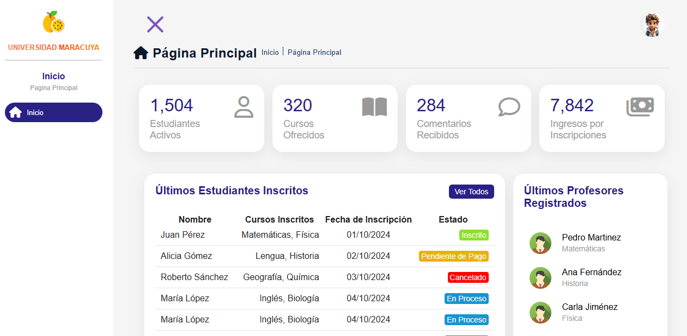
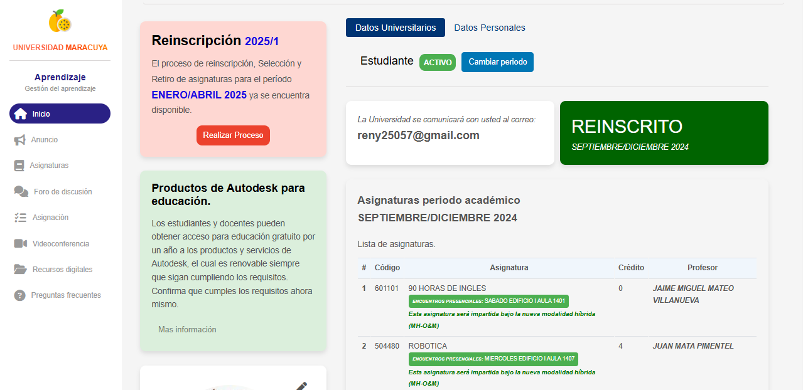
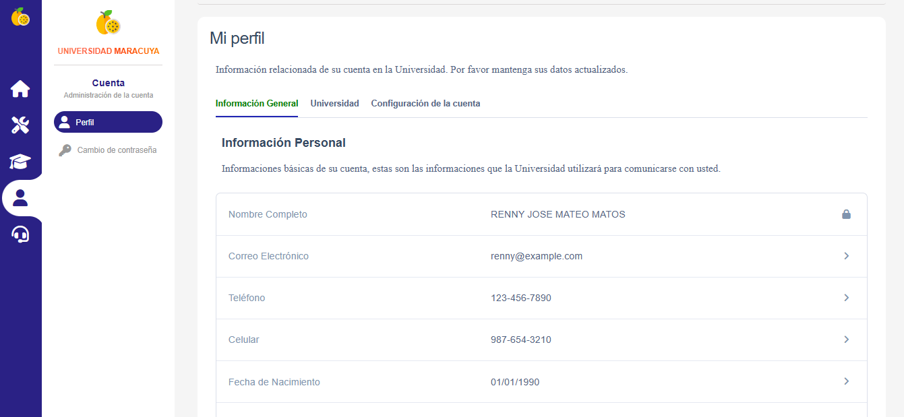
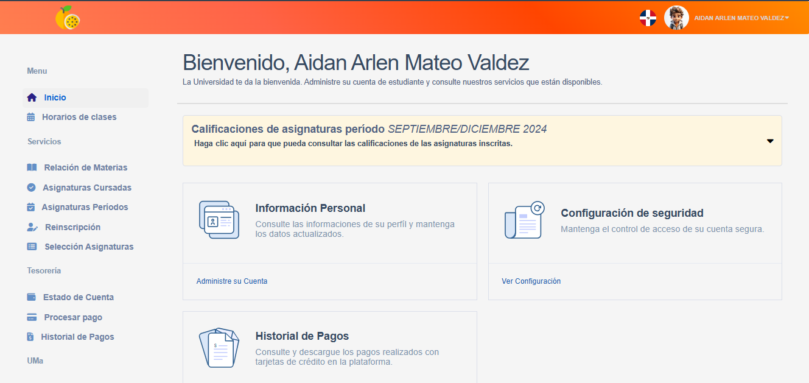

# Responsive School

Sistema de gestión universitario el cual esta basado en el esquema que tiene la plataforma de la o&m. 

La aplicación **Responsive-School** es un sistema de aprendizaje que (Organización y Gestión de Materiales) está diseñada para ser completamente **responsive**. Actualmente, es una aplicación frontend que presenta un diseño limpio y funcional, ideal para una experiencia de usuario fluida en dispositivos móviles y de escritorio.

## Screenshots - Páginas principales
**Dashboard**

**Pagina inicio**

**Perfil**

**Pagina de servicio**

## Features  - ✨ Características de la aplicación 

- **Diseño Responsive** 📱💻  
  La interfaz está optimizada para adaptarse a diferentes tamaños de pantalla, lo que asegura una experiencia de usuario fluida en **móviles**, **tabletas** y **escritorios**.

- **Interfaz limpia y moderna** 🎨  
  Un diseño sencillo y fácil de navegar que proporciona una experiencia de aprendizaje óptima. La disposición de los elementos sigue un patrón estructurado para facilitar el acceso al contenido.

- **Estructura de aprendizaje organizada** 📚  
  Los contenidos están organizados de manera clara,permitiendo a los usuarios navegar entre las lecciones, recursos y materiales de forma ordenada.

- **Componentes reutilizables** 🔄  
  La aplicación está construida con **React**, lo que permite la reutilización de componentes y mejora la mantenibilidad del código.

- **Estilos con CSS** 🎨  
  La aplicación utiliza **CSS** para crear un diseño atractivo y altamente personalizable. Esto asegura que el sistema no solo sea funcional, sino también visualmente atractivo.

- **Rendimiento optimizado** ⚡  
  El sistema está optimizado para asegurar tiempos de carga rápidos y una navegación fluida, incluso en dispositivos con recursos limitados.

### Lo que viene... 🚀
- Funcionalidades de **backend** para permitir la gestión de usuarios y contenido.

## Tech Stack

**Client:** React js, CSS

**Server:** aun no implementado

**Almacenamiento**: utilizando archivos json.